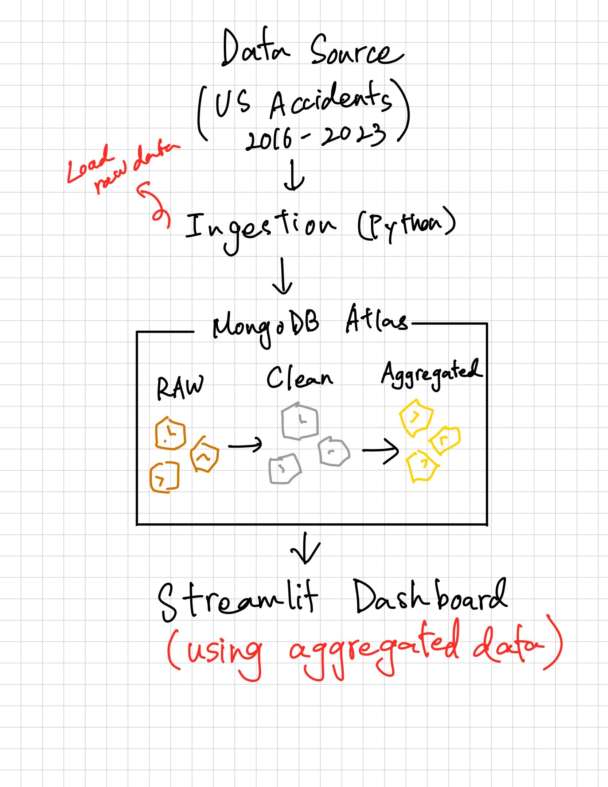

# BigDataToolsAndTechniquesCapstoneProject

This is the capstone project for the Big Data Tools and Techniques course. We are utilizing MongoDB Atlas and Python to examine, clean, aggregate, and visualize information from a dataset.

## Dependencies
- `pymongo`
- `pandas`
- `pydantic`
- `streamlit`
- `plotly`
- `pytest`
- `mypy`
- `python-dotenv`
- `pandas-stubs` (for `mypy` type checking with pandas)

## Architecture of Capstone

## How the Pipeline Works
1. Data Ingestion (Bronze Layer)
* Inside `raw_data`, `ingest_accidents.py` loads the raw dataset, and is stored without modification in `accidents_raw`.

2. Data Reading and Schema Read (Bronze Layer)
* In `raw_data`, `db_row_count_schema` details row count and summarizes schema through sampling.

3. Schema Validation (Silver Layer)

* In the `clean_data` folder, `validate_accidents_schema.py` checks raw data structure.
* Validation results are saved in `schema_validation_results.txt`.

4. Data Cleaning (Silver Layer)

* In `clean_data`, we use `silver_cleaning.py` to handle data cleaning:
    * Converts date/time columns
    * Converts numeric fields
    * Removes invalid or missing records
    * Cleaned data is saved into `accidents_clean`.

5. Data Aggregation (Gold Layer)

- In `aggregated_data`, `aggregation.py` uses MongoDB aggregation pipelines.
- Data is grouped by State and Severity.
- Metrics include:
    - Accident count
    - Average distance
    - Average temperature
- Results are saved to `accidents_aggregated`.

6. Data Visualization 
- In `aggregated_data`, `streamlit_app.py` reads from the aggregated collection only.
- Provides interactive charts and filters for analysis.

## Execution Order (Run each scripts in the following order)
Use the following commands either after changing directory to their 
respective folders or with the folder included in the command line like `<.foldername/><scriptname.py>`
1. Run `ingest_accidents.py` using `python ingest_accidents.py`.

2. Run `db_row_count_schema` using `python db_row_count_schema.py`.

3. Run `silver_cleaning.py` using `python silver_cleaning.py`.

4. Run `validate_accidents_schema.py` using `python validate_accidents_schema.py`.

5. Run `aggregation.py` using `python aggregation.py`.

6. Run `streamlit_app.py` using `streamlit run streamlit_app.py`. 

If you have any issues with any of these commands, try running them with `python -m` if the dependencies are already installed.

## Query Modeling & Performance Optimization

To improve query performance on large-scale datasets (7+ million records),
we implemented query modeling using MongoDB indexes.

In `query_modeling.py`, indexes were created on commonly queried fields to optimize filtering, grouping, and aggregation operations.

## Testing (PyTest)

We include 3 automated tests in the `tests/` folder to satisfy the PyTest requirement.
To run tests, make sure pytest is properly installed, and simply run `pytest` in terminal to run all tests in the `tests` folder. 

## Mypy type checking
In the terminal, use `mypy` to do type checking in `ingest_accidents.py`, `silver_cleaning.py`, and `aggregation_py`.

## Indexes Created
- `accidents_clean`:
  - Compound index on (State, Severity)
- `accidents_aggregated`:
  - Compound index on (State, Severity)

These indexes improve:
- Aggregation performance
- Streamlit dashboard filtering
- Read/query efficiency on large collections
